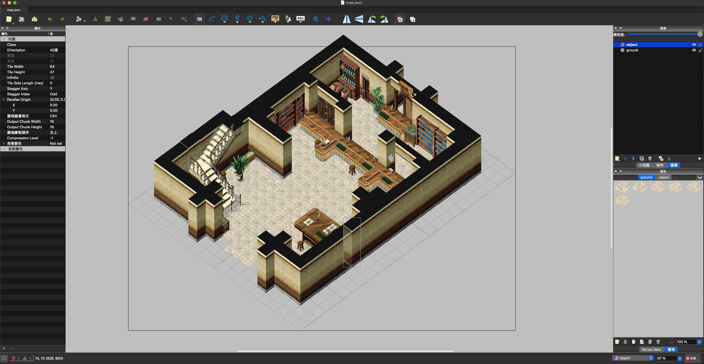
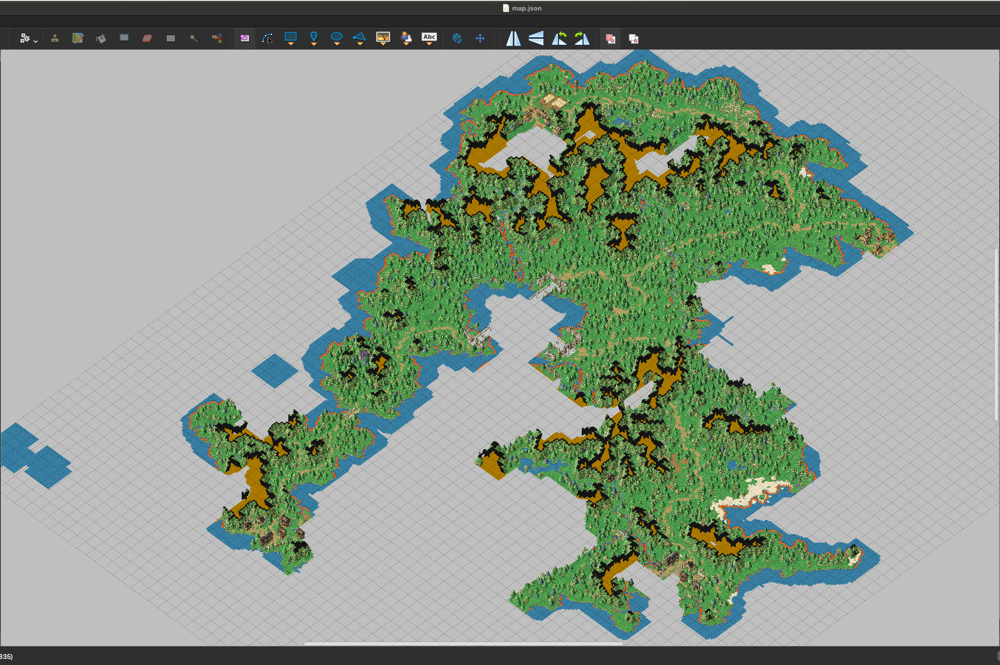

# XGTool

The toolchain of x-gate, maybe works with CrossGate(?).

## Demo





## Available Tools

### Dump Graphic

Dump graphics from `GraphicInfo.bin` and `Graphic.bin`.

```shell
$ export GIF="/Game/Crossgate/bin/GraphicInfo_66.bin" && \
  export GF="/Game/Crossgate/bin/Graphic_66.bin" && \
  export PF="/Game/Crossgate/bin/pal/Palette"

$ go run ./cmd/main.go dump-graphic \
      -gif $GIF \
      -gf  $GF \
      -pf  $PF \
      -dry-run
```

### DumpAnime

Dump animations from `AnimeInfo.bin` and `Anime.bin`.

```shell
# 適用於 1.0 和 2.0
$ export AIF="testdata/anime_info/AnimeInfo_4.bin" && \
  export AF="testdata/anime/Anime_4.bin" && \
  export GIF="testdata/graphic_info/GraphicInfo_66.bin" && \
  export GF="testdata/graphic/Graphic_66.bin" && \
  export PF="testdata/palette/palet_00.cgp" 

$ go run ./cmd/main.go dump-anime \
      -aif $AIF \
      -af  $AF \
      -gif $GIF \
      -gf  $GF \
      -pf  $PF \
      -dry-run

# 適用於 3.0 及以上
## AnimeV3, Anime_PUK2_4, Anime_PUK3_2 都是使用 GraphicInfoV3 及 GraphicV3 作為調色盤索引；
## Anime_Joy 與之後的版本則是使用自己的 GraphicInfo 和 Graphic 作為調色盤索引
$ export AIF="testdata/anime_info/AnimeInfoV3_8.bin" && \
  export AF="testdata/anime/AnimeV3_8.bin" && \
  export GIF="testdata/graphic_info/GraphicInfoV3_19.bin" && \
  export GF="testdata/graphic/GraphicV3_19.bin" && \
  export PF="testdata/palette/palet_00.cgp" && \
  export PGIF="testdata/graphic_info/GraphicInfoV3_19.bin" && \
  export PGF="testdata/graphic/GraphicV3_19.bin"
  
$ export AIF="testdata/anime_info/AnimeInfo_Joy_EX_146.bin" && \
  export AF="testdata/anime/Anime_Joy_EX_146.bin" && \
  export GIF="testdata/graphic_info/GraphicInfo_Joy_EX_152.bin" && \
  export GF="testdata/graphic/Graphic_Joy_EX_152.bin" && \
  export PF="testdata/palette/palet_00.cgp" && \
  export PGIF="testdata/graphic_info/GraphicInfo_Joy_EX_152.bin" && \
  export PGF="testdata/graphic/Graphic_Joy_EX_152.bin"

$ go run ./cmd/main.go go dump-anime \
      -aif $AIF \
      -af  $AF \
      -gif $GIF \
      -gf  $GF \
      -pf  $PF \
      -pgif $PGIF \
      -PGF $PGF \
      -dry-run
```

### Convert Map

Convert map into tmx (json) format.

```shell
$ export GIF="/Game/Crossgate/bin/GraphicInfo_66.bin" && \
  export GF="/Game/Crossgate/bin/Graphic_66.bin" && \
  export PF="/Game/Crossgate/bin/pal/Palette" && \
  export MF="/Game/Crossgate/map/1000.bin" # 法蘭城

$ go run ./cmd/main.go convert-map \
    -gif $GIF \
    -gf  $GF \
    -pf  $PF \
    -mf  $MF \
    -dry-run
```
